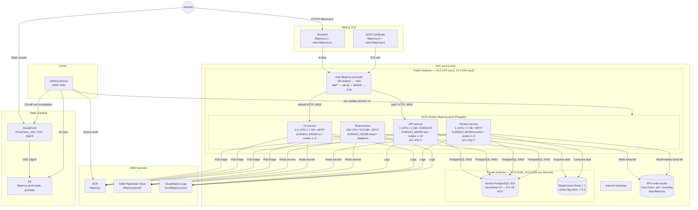

# FileProxy — Terraform Infrastructure

## Overview

This directory contains the complete AWS infrastructure for FileProxy in production. The stack runs a containerized Django application across four independent ECS Fargate services placed behind an Application Load Balancer (ALB) with HTTPS termination via ACM. Static files are served from a private S3 bucket through a CloudFront distribution with Origin Access Control. The database is Aurora PostgreSQL (Serverless v2) in private subnets. Async file uploads are queued via Celery backed by ElastiCache Redis, with a shared EFS write-cache volume. DNS is managed by Route 53 for `fileproxy.io`. Deployments are fully automated via GitHub Actions using OIDC (no long-lived AWS credentials).

---

## Prerequisites

Before running `terraform apply` for the first time:

1. **AWS CLI** configured with credentials that have sufficient IAM permissions
2. **Terraform >= 1.6**
3. **S3 state bucket** `fileproxy-tf-state` must exist (create manually or via separate bootstrap)
4. **DynamoDB lock table** `fileproxy-tf-locks` must exist
5. **Route 53 hosted zone** for `fileproxy.io` — Terraform creates it, but you must update your registrar's nameservers to the values output by `terraform output route53_nameservers`
6. **Manual secrets** — after the first apply, seed real values into SSM (see [Secrets](#secrets-secretstf))

---

## Folder Structure

| File | Purpose |
|---|---|
| `main.tf` | Terraform backend (S3 + DynamoDB), AWS provider, default tags |
| `variables.tf` | All input variable definitions |
| `terraform.tfvars` | Variable values (`github_org`, `github_repo`) |
| `outputs.tf` | Key outputs: ALB DNS, ECR URL, CloudFront domain, GitHub Actions role ARN, Route 53 nameservers |
| `network.tf` | VPC, public/private subnets, Internet Gateway, route tables |
| `security.tf` | Security groups for ALB, ECS web tasks, ECS worker tasks, and RDS |
| `ecs.tf` | ECS cluster, task definitions × 4, services × 4, Application Auto Scaling |
| `load_balancer.tf` | ALB, API + UI target groups, HTTP→HTTPS redirect listener, HTTPS listener with path routing |
| `database.tf` | Aurora PostgreSQL cluster + instance, DB subnet group, SSM parameters for DB credentials |
| `filesystem.tf` | One Zone EFS write-cache file system, mount target, EFS access point, EFS security group |
| `cache.tf` | ElastiCache Redis (replication group), Redis security group, SSM parameter for broker URL |
| `storage.tf` | ECR repository + lifecycle policy, S3 static bucket, CloudFront OAC + distribution |
| `iam.tf` | GitHub Actions OIDC role, ECS execution role, ECS task role |
| `secrets.tf` | SSM placeholder parameters for app secrets, auto-computed `static_url` and `celery_broker_url` |
| `dns.tf` | Route 53 zone, ACM certificate (DNS validation), A alias records |
| `compute.tf` | Placeholder only — EC2 ASG removed; file retained as migration note |

---

## Resource Inventory

### Networking (`network.tf`)

- **VPC** `10.0.0.0/16` — DNS support and DNS hostnames enabled
- **Public subnets** — `10.0.1.0/24`, `10.0.2.0/24` (one per AZ) — ECS Fargate tasks and ALB live here; tasks receive public IPs for outbound internet access (ECR pulls, SSM, CloudWatch)
- **Private subnets** — `10.0.11.0/24`, `10.0.12.0/24` (one per AZ) — RDS and Redis only; no internet route, no NAT gateway
- **Internet Gateway** attached to the VPC; public route table sends `0.0.0.0/0` → IGW
- **Private route table** has no default route — private subnets have zero internet access by design

### Security Groups (`security.tf`, `cache.tf`, `filesystem.tf`)

| Name | Inbound | Outbound |
|---|---|---|
| `fileproxy-prod-alb-sg` | TCP 80 and 443 from `0.0.0.0/0` | All traffic |
| `fileproxy-prod-ecs-sg` | TCP 8000 from `alb-sg` | All traffic |
| `fileproxy-prod-ecs-worker-sg` | None (egress-only) | All traffic |
| `fileproxy-prod-rds-sg` | TCP 5432 from `ecs-sg` and `ecs-worker-sg` | All traffic |
| `fileproxy-prod-redis-sg` | TCP 6379 from `ecs-sg` and `ecs-worker-sg` | All traffic |
| `fileproxy-prod-efs-sg` | TCP 2049 from `ecs-sg` and `ecs-worker-sg` | All traffic |

Cross-SG ingress rules are managed as separate `aws_vpc_security_group_ingress_rule` resources (not inline blocks) to avoid Terraform dependency cycles during plan.

### ECS Fargate (`ecs.tf`)

**Cluster:** `fileproxy-prod` with Container Insights enabled, FARGATE + FARGATE_SPOT capacity providers.

**Task definitions:**

| Service | CPU | Memory | Mode | Notes |
|---|---|---|---|---|
| `fileproxy-prod-api` | 1024 (1 vCPU) | 2048 MB | `DJANGO_MODE=api` | Strips session/CSRF/message middleware; Bearer-token auth only |
| `fileproxy-prod-ui` | 512 (0.5 vCPU) | 1024 MB | `DJANGO_MODE=ui` | Full middleware stack |
| `fileproxy-prod-worker` | 1024 (1 vCPU) | 2048 MB | `DJANGO_MODE=worker` | Celery worker, 4 concurrency |
| `fileproxy-prod-beat` | 256 | 512 MB | `DJANGO_MODE=beat` | Celery beat scheduler, singleton |

API and worker tasks mount the EFS write-cache at `/tmp/fileproxy`. All tasks inject SSM secrets natively (values never appear in DescribeTasks output).

**Services:**

| Service | Capacity | Subnets | Load balancer | Min healthy |
|---|---|---|---|---|
| `fileproxy-prod-api` | FARGATE, scales 1–10 | `public[0]` only¹ | `api-tg` | 100% |
| `fileproxy-prod-ui` | SPOT(×4)/FARGATE(×1), scales 1–3 | Both public | `ui-tg` | 100% |
| `fileproxy-prod-worker` | SPOT(×4)/FARGATE(×1), scales 1–5 | `public[0]` only¹ | None | 100% |
| `fileproxy-prod-beat` | SPOT(×4)/FARGATE(×1), fixed 1 | Both public | None | 0% (singleton) |

¹ Pinned to `azs[0]` — One Zone EFS only has a mount target in that AZ; tasks in `azs[1]` cannot resolve the EFS DNS endpoint.

**Auto Scaling:** Target tracking on `ECSServiceAverageCPUUtilization` for api (60%), ui (70%), and worker (60%).

### Load Balancer (`load_balancer.tf`)

- **ALB** `fileproxy-prod-alb` — public, across both public subnets
- **API target group** `fileproxy-prod-api-tg` — HTTP port 8000, `ip` type, deregistration delay 305 s, health check `GET /health/`
- **UI target group** `fileproxy-prod-ui-tg` — HTTP port 8000, `ip` type, deregistration delay 60 s, health check `GET /health/`
- **HTTP :80 listener** — 301 redirect to HTTPS :443
- **HTTPS :443 listener** — SSL policy `ELBSecurityPolicy-TLS13-1-2-2021-06`, ACM certificate
  - Priority 10: path `/api/*` → `api-tg`
  - Default: → `ui-tg`

### Database (`database.tf`)

- **Aurora PostgreSQL 16.6** cluster (`fileproxy-prod`) in Serverless v2 mode
  - Scaling: 0.5–16 ACU
  - Placed in private subnets via DB subnet group
  - Storage encrypted; final snapshot on deletion (`fileproxy-prod-final`)

### Cache (`cache.tf`)

- **ElastiCache Redis 7.1** single-node replication group (`fileproxy-prod-redis`)
  - Node type: `cache.t4g.micro`
  - Transit encryption enabled (TLS); connection URL stored in SSM as `celery_broker_url`
  - Used as Celery broker for async file upload tasks

### Write-Cache EFS (`filesystem.tf`)

- **One Zone EFS** in `azs[0]` — bursting throughput, encrypted; used as a shared temp-file store between the API (write) and Celery worker (read+delete)
- **Single mount target** in `public[0]` — One Zone EFS can only have a mount target in its own AZ
- **EFS access point** — root `/`, uid/gid 0, required for Fargate IAM-authenticated mounts
- Backups disabled (temp files are ephemeral)

### Storage & CDN (`storage.tf`)

- **ECR repository** `fileproxy` — mutable tags, scan on push, lifecycle policy keeps last 10 images
- **S3 bucket** `fileproxy-prod-static` — fully private; CloudFront accesses it via OAC
- **CloudFront distribution** — PriceClass_100, S3 origin via OAC (SigV4), HTTP→HTTPS redirect, 1-year max TTL

### IAM (`iam.tf`)

**GitHub Actions OIDC role** (`fileproxy-prod-github-actions`):
- Trust: `token.actions.githubusercontent.com`, subject `repo:JaminB/FileProxy:*`
- Permissions: ECR push, S3 static sync, CloudFront invalidation, `ecs:UpdateService/DescribeServices`

**ECS execution role** (`fileproxy-prod-ecs-execution`):
- Trust: `ecs-tasks.amazonaws.com`
- Managed policy: `AmazonECSTaskExecutionRolePolicy` (ECR pull, CloudWatch Logs)
- Inline policy: `ssm:GetParameters` on `/fileproxy/${var.env}/*`

**ECS task role** (`fileproxy-prod-ecs-task`):
- Trust: `ecs-tasks.amazonaws.com`
- Permissions: ECR pull, S3 static read, EFS `ClientMount`/`ClientWrite`

### Secrets (`secrets.tf`)

Terraform creates SSM placeholder entries on first apply. `lifecycle { ignore_changes = [value] }` ensures Terraform never overwrites values set manually.

| Parameter | Type | Set by |
|---|---|---|
| `/fileproxy/prod/django_secret_key` | SecureString | Manual |
| `/fileproxy/prod/fileproxy_vault_master_key` | SecureString | Manual |
| `/fileproxy/prod/google_client_id` | String | Manual |
| `/fileproxy/prod/google_client_secret` | SecureString | Manual |
| `/fileproxy/prod/dropbox_app_key` | String | Manual |
| `/fileproxy/prod/dropbox_app_secret` | SecureString | Manual |
| `/fileproxy/prod/static_url` | String | Terraform (CloudFront URL) |
| `/fileproxy/prod/celery_broker_url` | SecureString | Terraform (ElastiCache endpoint) |

### DNS & TLS (`dns.tf`)

- **Route 53 hosted zone** for `fileproxy.io`
- **ACM certificate** covering `fileproxy.io` and `www.fileproxy.io`, DNS validated
- **A alias records**: `fileproxy.io` and `www.fileproxy.io` → ALB

---

## Architecture Diagram



① API and Worker services are pinned to `azs[0]` because the One Zone EFS file system and its single mount target both live there. Tasks in `azs[1]` cannot resolve the AZ-specific EFS DNS record.

---

## Terraform State

| Setting | Value |
|---|---|
| Backend | S3 |
| Bucket | `fileproxy-tf-state` |
| Key | `prod/terraform.tfstate` |
| Region | `us-east-1` |
| Encryption | Enabled |
| Lock table | `fileproxy-tf-locks` (DynamoDB) |

---

## Deployment Workflow

Every push to `main` triggers GitHub Actions:

1. **OIDC authentication** — assumes `fileproxy-prod-github-actions` role (no stored AWS credentials)
2. **Test** — Django test suite runs against a PostgreSQL service container
3. **Build & push** — Docker image built and pushed to ECR as `:<sha>` and `:latest`
4. **Static files** — `aws s3 sync` uploads compiled static assets; CloudFront cache invalidated for `/static/*`
5. **Deploy** — `aws ecs update-service --force-new-deployment` called in parallel for all four services; `aws ecs wait services-stable` gates on API and UI becoming healthy

---

## Traffic Flow

**Dynamic requests:**
```
Browser → Route 53 (fileproxy.io) → ALB :443 (TLS termination)
  ├─ /api/*  → API Fargate tasks → Aurora PostgreSQL
  └─ default → UI  Fargate tasks → Aurora PostgreSQL
```

**Async file uploads:**
```
API task → writes file to EFS → enqueues Celery task to Redis
Worker task → reads task from Redis → reads file from EFS → uploads to backend (S3/GDrive/etc.)
```

**Static assets:**
```
Browser → CloudFront → S3 fileproxy-prod-static (OAC SigV4)
```

---

## Key Notes

- **No NAT Gateway** — Fargate tasks run in public subnets with `assign_public_ip = ENABLED` to reach ECR, SSM, and CloudWatch without a NAT gateway; inbound is restricted by security groups (API/UI only accept port 8000 from the ALB SG)
- **Worker SG is egress-only** — `ecs-worker-sg` has no inbound rules; the worker and beat tasks have no HTTP listener and must not inherit the ALB ingress rule
- **EFS is One Zone** — data lives in a single AZ (`azs[0]`) for cost; EFS-mounting services are pinned to `public[0]` so DNS resolution always succeeds
- **Beat is a singleton** — `deployment_maximum_percent = 100` prevents ECS from ever running two beat instances simultaneously (two beats = every scheduled job fires twice)
- **Secrets are placeholder-only** — Terraform creates SSM entries with `"REPLACE_ME"` values and then ignores future changes; real values must be set manually after first apply
- **`desired_count` is ignored** — `lifecycle { ignore_changes = [desired_count] }` prevents Terraform from overriding auto-scaling decisions
- **CloudFront cert** — CloudFront uses its default `*.cloudfront.net` certificate; the ACM cert covers only the ALB (apex + www)
