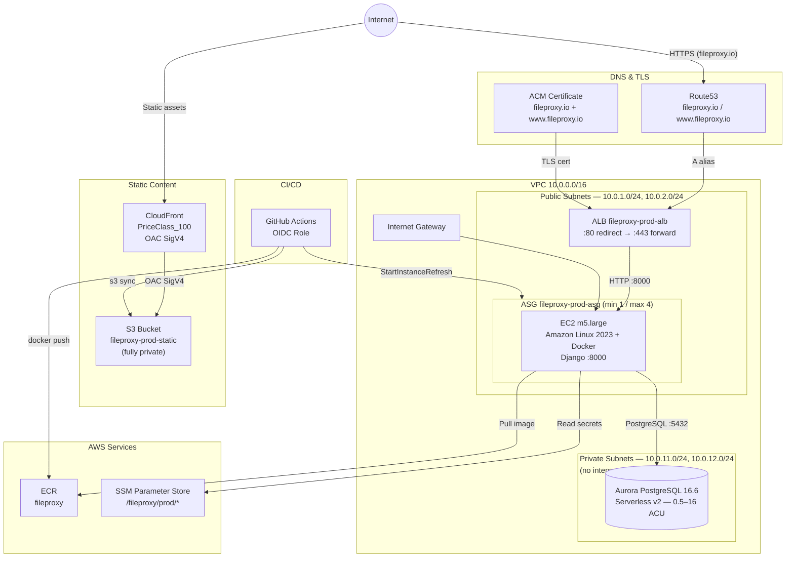

# FileProxy — Terraform Infrastructure

## Overview

This directory contains the complete AWS infrastructure for FileProxy in production. The stack runs a containerized Django application on EC2 instances managed by an Auto Scaling Group (ASG), placed behind an Application Load Balancer (ALB) with HTTPS termination via ACM. Static files are served from a private S3 bucket through a CloudFront distribution with Origin Access Control. The database is Aurora PostgreSQL (Serverless v2) in private subnets. DNS is managed by Route 53 for `fileproxy.io`. Deployments are fully automated via GitHub Actions using OIDC (no long-lived AWS credentials).

---

## Prerequisites

Before running `terraform apply` for the first time:

1. **AWS CLI** configured with credentials that have sufficient IAM permissions
2. **Terraform >= 1.6**
3. **S3 state bucket** `fileproxy-tf-state` must exist (create manually or via separate bootstrap)
4. **DynamoDB lock table** `fileproxy-tf-locks` must exist
5. **Route 53 hosted zone** for `fileproxy.io` — Terraform creates it, but you must update your registrar's nameservers to the values output by `terraform output route53_nameservers`
6. **Manual secrets** — after the first apply, seed real values into SSM (see [Secrets](#secrets-secretstf))

---

## Folder Structure

| File | Purpose |
|---|---|
| `main.tf` | Terraform backend (S3 + DynamoDB), AWS provider, default tags |
| `variables.tf` | All input variable definitions |
| `terraform.tfvars` | Variable values (`github_org`, `github_repo`) |
| `outputs.tf` | Key outputs: ALB DNS, ECR URL, CloudFront domain, GitHub Actions role ARN, Route 53 nameservers |
| `network.tf` | VPC, public/private subnets, Internet Gateway, route tables |
| `security.tf` | Security groups for ALB, EC2, and RDS |
| `compute.tf` | AMI data source, Launch Template, Auto Scaling Group |
| `load_balancer.tf` | ALB, target group, HTTP→HTTPS redirect listener, HTTPS listener |
| `database.tf` | Aurora PostgreSQL cluster + instance, DB subnet group, SSM parameters for DB credentials |
| `storage.tf` | ECR repository + lifecycle policy, S3 static bucket, CloudFront OAC + distribution |
| `iam.tf` | GitHub Actions OIDC provider + role, EC2 instance role + profile |
| `secrets.tf` | SSM placeholder parameters for app secrets, auto-computed `static_url` |
| `dns.tf` | Route 53 zone, ACM certificate (DNS validation), A alias records |
| `user_data.sh.tpl` | EC2 bootstrap script template |

---

## Resource Inventory

### Networking (`network.tf`)

- **VPC** `10.0.0.0/16` — DNS support and DNS hostnames enabled
- **Public subnets** — `10.0.1.0/24`, `10.0.2.0/24` (one per AZ) — EC2 instances and ALB live here; instances receive public IPs for outbound internet access (ECR pulls, SSM)
- **Private subnets** — `10.0.11.0/24`, `10.0.12.0/24` (one per AZ) — RDS only; no internet route, no NAT gateway
- **Internet Gateway** attached to the VPC; public route table sends `0.0.0.0/0` → IGW
- **Private route table** has no default route — private subnets have zero internet access by design

### Security Groups (`security.tf`)

| Name | Inbound | Outbound |
|---|---|---|
| `fileproxy-prod-alb-sg` | TCP 80 and 443 from `0.0.0.0/0` | All traffic |
| `fileproxy-prod-ec2-sg` | TCP 8000 from `alb-sg` only | All traffic |
| `fileproxy-prod-rds-sg` | TCP 5432 from `ec2-sg` only | All traffic |

### Compute (`compute.tf`)

- **AMI**: latest Amazon Linux 2023 (`al2023-ami-*-x86_64`, HVM), resolved at plan time
- **Launch Template** (`fileproxy-prod-*`):
  - Instance type: `m5.large` (configurable via `instance_type` variable)
  - Root volume: 30 GB gp3, deleted on termination
  - Public IP assigned on launch
  - `user_data`: base64-encoded `user_data.sh.tpl`, templated with `aws_region`, `ecr_url`, `alb_dns`
- **Auto Scaling Group** `fileproxy-prod-asg`:
  - Spans both public subnets
  - Min 1, max 4, desired 1 (desired is ignored in Terraform state to avoid interfering with auto-scaling)
  - Health check type: `ELB`
  - Instance refresh strategy: `Rolling`, 50% minimum healthy percentage (zero-downtime deploys)
  - Launch template version: `$Latest`

### Load Balancer (`load_balancer.tf`)

- **ALB** `fileproxy-prod-alb` — public, across both public subnets
- **Target group** `fileproxy-prod-tg` — HTTP port 8000, health check `GET /accounts/login/` → HTTP 200 (2 healthy / 3 unhealthy threshold, 30s interval, 10s timeout)
- **HTTP :80 listener** — 301 redirect to HTTPS :443
- **HTTPS :443 listener** — SSL policy `ELBSecurityPolicy-TLS13-1-2-2021-06` (TLS 1.2+/1.3), ACM certificate, forwards to target group

### Database (`database.tf`)

- **Aurora PostgreSQL 16.6** cluster (`fileproxy-prod`) in Serverless v2 mode
  - Scaling: 0.5–16 ACU
  - Instance class: `db.serverless`
  - Database name and master username: `fileproxy`
  - Password: randomly generated 32-character alphanumeric string
  - Storage encrypted; final snapshot taken on deletion (`fileproxy-prod-final`)
  - Placed in private subnets via DB subnet group
- **SSM parameters** auto-written by Terraform (plain `String` or `SecureString`):

| Parameter | Type | Value |
|---|---|---|
| `/fileproxy/prod/db_host` | String | Aurora cluster endpoint |
| `/fileproxy/prod/db_name` | String | `fileproxy` |
| `/fileproxy/prod/db_user` | String | `fileproxy` |
| `/fileproxy/prod/db_password` | SecureString | Random password |

### Storage & CDN (`storage.tf`)

- **ECR repository** `fileproxy` — mutable tags, scan on push, lifecycle policy keeps last 10 images
- **S3 bucket** `fileproxy-prod-static` — fully private (all public access blocked); CloudFront accesses it via OAC
- **CloudFront OAC** — SigV4 signing, always signs, S3 origin type
- **CloudFront distribution**:
  - Price class: `PriceClass_100` (US, Canada, Europe)
  - Origin: S3 via OAC (no public S3 URLs)
  - Viewer protocol: redirect HTTP → HTTPS
  - Allowed/cached methods: GET, HEAD
  - Default TTL: 86400s (1 day), max TTL: 31536000s (1 year)
  - CORS response headers policy: `GET`/`HEAD` from any origin
  - Uses the default CloudFront TLS certificate (`*.cloudfront.net`)
- **S3 bucket policy** — grants `s3:GetObject` to CloudFront service principal, scoped to the specific distribution ARN

### IAM (`iam.tf`)

**GitHub Actions OIDC role** (`fileproxy-prod-github-actions`):
- Trust: `token.actions.githubusercontent.com`, audience `sts.amazonaws.com`, subject `repo:JaminB/FileProxy:*`
- Permissions:
  - `ecr:GetAuthorizationToken` on `*`
  - ECR push actions on the `fileproxy` repository
  - `s3:PutObject/GetObject/DeleteObject/ListBucket` on `fileproxy-prod-static`
  - `autoscaling:StartInstanceRefresh/DescribeInstanceRefreshes/DescribeAutoScalingGroups` on `*`

**EC2 instance role** (`fileproxy-prod-ec2`):
- Trust: `ec2.amazonaws.com`
- Permissions:
  - `ecr:GetAuthorizationToken` on `*`
  - ECR pull actions on the `fileproxy` repository
  - `ssm:GetParametersByPath/GetParameter/GetParameters` on `/fileproxy/prod/*`
  - `s3:GetObject/ListBucket` on `fileproxy-prod-static`

### Secrets (`secrets.tf`)

Terraform creates SSM placeholder entries on first apply. `lifecycle { ignore_changes = [value] }` ensures Terraform never overwrites values set manually.

| Parameter | Type | Set by |
|---|---|---|
| `/fileproxy/prod/django_secret_key` | SecureString | Manual |
| `/fileproxy/prod/fileproxy_vault_master_key` | SecureString | Manual |
| `/fileproxy/prod/google_client_id` | String | Manual |
| `/fileproxy/prod/google_client_secret` | SecureString | Manual |
| `/fileproxy/prod/dropbox_app_key` | String | Manual |
| `/fileproxy/prod/dropbox_app_secret` | SecureString | Manual |
| `/fileproxy/prod/static_url` | String | Terraform (CloudFront URL) |

Set real values after first apply using the `/manage-environment-variables` slash command or:

```bash
MSYS_NO_PATHCONV=1 aws ssm put-parameter \
  --name "/fileproxy/prod/django_secret_key" \
  --value "..." \
  --type SecureString \
  --overwrite \
  --region us-east-1
```

### DNS & TLS (`dns.tf`)

- **Route 53 hosted zone** for `fileproxy.io` — after apply, set your registrar's nameservers to `terraform output route53_nameservers`
- **ACM certificate** covering `fileproxy.io` and `www.fileproxy.io`, DNS validated via auto-created CNAME records in Route 53
- **A alias records**: both `fileproxy.io` and `www.fileproxy.io` → ALB (with health evaluation)

---

## EC2 Bootstrap (`user_data.sh.tpl`)

Each new EC2 instance runs the following at launch:

1. `yum update -y && yum install -y docker aws-cli jq` — update OS and install dependencies
2. `systemctl enable docker && systemctl start docker` — start Docker daemon
3. `aws ecr get-login-password | docker login` — authenticate to ECR using the instance role
4. `aws ssm get-parameters-by-path /fileproxy/prod/ --with-decryption` — fetch all SSM parameters and write them as `KEY=VALUE` pairs to `/etc/fileproxy.env`
5. Append `DJANGO_ALLOWED_HOSTS` (ALB DNS + private IP + apex/www domains) and `CSRF_TRUSTED_ORIGINS` to `/etc/fileproxy.env`
6. `docker pull <ecr>:latest && docker run -d --restart unless-stopped -p 8000:8000 --env-file /etc/fileproxy.env <ecr>:latest` — start the Django container

---

## Terraform State

| Setting | Value |
|---|---|
| Backend | S3 |
| Bucket | `fileproxy-tf-state` |
| Key | `prod/terraform.tfstate` |
| Region | `us-east-1` |
| Encryption | Enabled |
| Lock table | `fileproxy-tf-locks` (DynamoDB) |

---

## Deployment Workflow

Every push to `main` triggers GitHub Actions:

1. **OIDC authentication** — GitHub Actions assumes `fileproxy-prod-github-actions` role (no stored AWS credentials)
2. **Build** — Docker image built from repo root
3. **Push** — image pushed to ECR as `:latest`
4. **Static files** — `aws s3 sync` uploads compiled static assets to `fileproxy-prod-static`
5. **Instance refresh** — `aws autoscaling start-instance-refresh` triggers a rolling replacement of EC2 instances at 50% min healthy
6. **New instances** — each replacement EC2 runs `user_data.sh.tpl`, pulls `:latest` from ECR, starts the container with live secrets from SSM

---

## Traffic Flow

**Dynamic requests:**
```
Browser → Route 53 (fileproxy.io) → ALB :443 (TLS termination) → EC2 :8000 → Django in Docker → Aurora PostgreSQL
```

**Static assets:**
```
Browser → CloudFront (*.cloudfront.net) → S3 fileproxy-prod-static (OAC SigV4)
```

---

## Architecture Diagram



---

## Key Notes

- **No NAT Gateway** — private subnets have zero internet access by design; RDS is fully isolated from the internet
- **EC2 in public subnets** — instances need direct internet access to pull images from ECR and fetch SSM parameters; they are protected by the `ec2-sg` security group which only allows inbound from the ALB
- **Secrets are placeholder-only** — Terraform creates SSM entries with `"REPLACE_ME"` values and then ignores future changes; real values must be set manually after first apply
- **`desired_capacity` is ignored** — `lifecycle { ignore_changes = [desired_capacity] }` prevents Terraform from overriding auto-scaling decisions
- **Rolling deploys** — `min_healthy_percentage = 50` means at least half the fleet stays healthy during an instance refresh, achieving zero-downtime deployments
- **CloudFront cert** — CloudFront uses its own default `*.cloudfront.net` certificate; the ACM cert covers only the ALB (apex + www)
